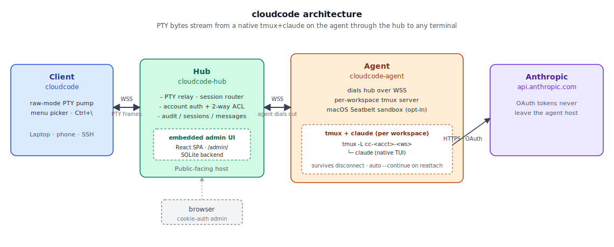

# cloudcode

> 自托管 LLM 网关，让团队以集中受控的方式使用 AI coding CLI（如 Claude Code）。
> Hub 做账号鉴权与审计，Agent 持有订阅 OAuth 凭据，Client 体验和裸跑 AI CLI 一致。

---

## 概述

**cloudcode** 由三个小工具组成：

- **`cloudcode-hub`**（中转层）—— 持有账号 token，做鉴权、ACL、路由、审计。**不直接持有 Anthropic 凭据**。
- **`cloudcode-agent`**（订阅模式后端）—— 部署在已经 `claude /login` 过的机器上，读本地 `~/.claude/.credentials.json`，把 hub 转来的请求加上 OAuth Bearer header 转发到 Anthropic。OAuth refresh 由 agent 自己完成，凭据**永不离开** agent。
- **`cloudcode`**（客户端）—— 在开发者本地启动原生 AI CLI（`claude` 等），透明把流量经 hub 转发，体验与裸跑一致。

支持两种后端模式（可在 hub 上共存）：

| 模式 | 凭据形式 | 计费 | 配置位置 |
|------|----------|------|----------|
| **API key** | `sk-ant-...`（管理员控制台创建） | 按 token 付费 | hub 的 `[anthropic]` 段 |
| **订阅 (OAuth)** | Claude Pro / Max 订阅，通过 `claude /login` | 走订阅配额 | agent 持有，hub 仅引用 |

每个 cloudcode 账号通过 `allowed_agents` 和 `allowed_providers` 控制能用哪些后端。

> ⚠️ **合规提示**：把订阅账号共享给多人**违反 Anthropic ToS**，可能导致封号。建议每位用户绑自己的订阅（每人一个 agent），让 hub 仅作审计层。

## 架构



代码和构建产物始终在开发者本地——hub 和 agent 都只代理 HTTPS API 请求。可编辑源在 [`docs/architecture.drawio`](docs/architecture.drawio)（用 [diagrams.net](https://app.diagrams.net) 打开）。

## 安装

三个组件各有一行：

```bash
# Hub（远端中转服务器）
curl -fsSL https://raw.githubusercontent.com/initialz/cloudcode/main/install.sh | sh -s -- hub

# Agent（已登录 claude 的机器，可与 hub 同机）
curl -fsSL https://raw.githubusercontent.com/initialz/cloudcode/main/install.sh | sh -s -- agent

# Client（开发者本地）
curl -fsSL https://raw.githubusercontent.com/initialz/cloudcode/main/install.sh | sh -s -- client
```

在 Linux 上 hub/agent 模式会：

1. 从 GitHub Releases 拉对应平台的 musl 静态二进制
2. 安装到 `/usr/local/bin/`
3. 创建 `cloudcode` 系统用户、`/etc/cloudcode/`、相应 `/var/lib/` 目录
4. 写带 hardening 的 systemd unit（`NoNewPrivileges`、`ProtectSystem`、`ProtectHome` 等）

可选标记：

| 标记 | 作用 |
|------|------|
| `--no-service` | 只装二进制，跳过 systemd unit |
| `--service` | 强制装 systemd unit |
| `--prefix DIR` | 自定义安装前缀，默认 `/usr/local` |
| `--version vX.Y.Z` | 锁定版本 |

支持平台：Linux x86_64、Linux aarch64、macOS aarch64。

## 配置

### Agent（每个订阅一个 agent）

1. 在**能开浏览器**的机器上完成一次 claude OAuth：

   ```bash
   claude            # 进入 TUI 后输入 /login，浏览器完成 OAuth
   # 凭据落在 ~/.claude/.credentials.json
   ```

2. 把凭据复制到 agent 机器：

   ```bash
   scp ~/.claude/.credentials.json AGENT-HOST:/tmp/cc-credentials.json
   ssh AGENT-HOST
   sudo install -o cloudcode -g cloudcode -m 600 \
        /tmp/cc-credentials.json /var/lib/cloudcode-agent/credentials.json
   sudo rm /tmp/cc-credentials.json
   ```

3. 生成 hub ↔ agent 的共享密钥：

   ```bash
   cloudcode-agent gen-secret
   # 输出：明文 secret（一次性，留给 hub 配置）+ argon2id hash
   ```

4. 写 `/etc/cloudcode/agent.toml`：

   ```toml
   [server]
   listen = "0.0.0.0:7100"

   [auth]
   shared_secret_hash = "$argon2id$..."

   [claude]
   credentials_path = "/var/lib/cloudcode-agent/credentials.json"
   ```

5. 启动：

   ```bash
   sudo systemctl enable --now cloudcode-agent
   journalctl -u cloudcode-agent -f
   ```

Agent 每分钟检查 access_token 过期时间，临过期前自动用 refresh_token 换新，写回 `credentials.json`。

### Hub

1. 创建 `/etc/cloudcode/hub.toml`：

   ```toml
   [server]
   listen = "0.0.0.0:7000"
   audit_log = "/var/log/cloudcode/audit.jsonl"

   # 可选：API key 后端，作为没有可用 agent 时的回退
   [anthropic]
   upstream = "https://api.anthropic.com"
   api_key = "sk-ant-..."

   # 订阅后端
   [[agents]]
   name = "max-1"
   url = "http://AGENT-HOST:7100"
   shared_secret = "ag_xxxxxxxxxxxxxxxx"  # 明文，agent 端存的是 hash
   ```

2. 为每个用户生成账号 token：

   ```bash
   cloudcode-hub gen-token alice
   # 输出明文 token（仅一次，给用户）+ argon2id hash（粘到 hub.toml）
   ```

3. 在 `hub.toml` 添加账号 + 路由策略：

   ```toml
   [[accounts]]
   name = "alice"
   token_hash = "$argon2id$..."
   allowed_agents = ["max-1"]           # 优先用 agent
   allowed_providers = ["anthropic"]    # 没 agent 可用时回退 API key

   [[accounts]]
   name = "bob"
   token_hash = "$argon2id$..."
   allowed_agents = ["max-1"]
   # 不写 allowed_providers → 没 agent 可用时直接 403
   ```

   **路由策略**：按 `allowed_agents` 顺序找第一个可用 agent；找不到则查 `allowed_providers` 是否含 `"anthropic"`/`"*"`，回退到 `[anthropic]` API key；都没有则 403。

4. 启动：

   ```bash
   sudo systemctl enable --now cloudcode-hub
   journalctl -u cloudcode-hub -f
   ```

> 生产环境建议在 hub 前置 TLS 终止层（Caddy / nginx / Cloudflare），不直接暴露 7000 端口到公网。Agent 端口（7100）通常仅在内网开放。

### Client

`~/.config/cloudcode/config.toml`：

```toml
hub_url = "https://hub.example.com"
token   = "cc_xxx_from_admin"
```

## 使用

```bash
cd ~/code/myproj
cloudcode run claude
```

`cloudcode` 注入 `ANTHROPIC_BASE_URL` 与 `ANTHROPIC_AUTH_TOKEN` 后 `exec` 真正的 `claude`——本地源码、本地依赖、本地终端 UI 不变。工具的每个 `POST /v1/messages`（含 SSE 流式响应）由 hub 鉴权、按账号路由到 agent 或直连 API、并写一条审计记录。

### 子命令一览

```
cloudcode run <tool>                启动 AI CLI 工具
cloudcode config                    显示当前 client 配置

cloudcode-hub serve [--config hub.toml]    启动 hub
cloudcode-hub gen-token <name>             生成新账号 token

cloudcode-agent serve [--config agent.toml]   启动 agent
cloudcode-agent gen-secret                    生成 hub↔agent 共享密钥
```

## 审计日志

每次请求追加一行 JSON 到配置中的 `audit_log`：

```jsonl
{"ts":"2026-05-11T01:59:48Z","event":"auth_denied","provider":"anthropic","status":401,"reason":"missing token"}
{"ts":"2026-05-11T01:59:49Z","event":"messages_request","account":"alice","provider":"anthropic","backend":"agent:max-1","model":"claude-opus-4-7","status":200,"stream":true}
{"ts":"2026-05-11T02:01:14Z","event":"messages_request","account":"bob","provider":"anthropic","backend":"anthropic-api-key","model":"claude-opus-4-7","status":200,"stream":true}
{"ts":"2026-05-11T02:10:00Z","event":"auth_denied","account":"carol","provider":"anthropic","status":403,"reason":"no allowed backend"}
```

`backend` 字段标明实际后端是 agent 还是直连 API key——可灌入任何审计/计量系统区分订阅消耗 vs API 计费。

## 当前状态

MVP 已可用：

- ✅ API key 模式（直连 Anthropic）
- ✅ 订阅模式（agent + OAuth refresh）
- ✅ 多 agent、按账号 ACL 路由
- ✅ SSE 流式转发
- ✅ JSONL 审计（含 backend 区分）
- ✅ systemd 服务化、curl 一键安装

⚠️ **未官方验证**：agent 的 OAuth refresh endpoint 与 client_id 来自社区反编译，未经 Anthropic 文档背书。Anthropic 协议变更可能要求 agent 更新。

后续路线：

- OpenAI / codex 支持
- SSE 流量计量（实际 token 用量、订阅余额）
- Web 管理界面（账号 CRUD、token 撤销、审计查看、agent 健康）
- 配额、限速、token 轮换、负载均衡（多 agent 中按健康/余额选择）

## 本地开发

```bash
cargo build              # 编译三个二进制
cargo run -p cloudcode-hub   -- gen-token alice
cargo run -p cloudcode-hub   -- serve --config /tmp/hub.toml
cargo run -p cloudcode-agent -- gen-secret
cargo run -p cloudcode-agent -- serve --config /tmp/agent.toml
cargo run -p cloudcode-client -- run claude
```

`cargo build --release` 出 `target/release/cloudcode-hub`、`cloudcode-agent`、`cloudcode`。Release workflow 用 musl target 产出静态二进制，无 glibc 依赖。

## License

MIT
